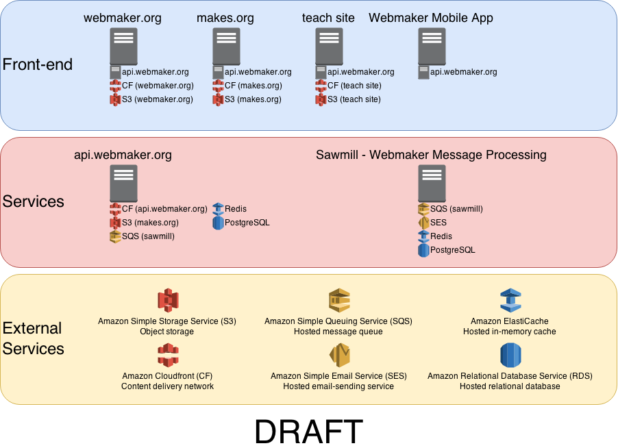

# Proposed Webmaker architecture

This is a proposed architecture for all Webmaker apps.

## The big picture

You probably want to open this in another window

## What's changed?

* Focus on 3-4 products
* Get rid of application servers
* One (Webmaker) API to rule them all, and in the darkness bind them
  * Login (signup, signin, roles, OAuth 2.0)
  * Makes (metadata, content, publishing)
  * Events, maybe
  * Badges, maybe
  * Clubs, maybe
