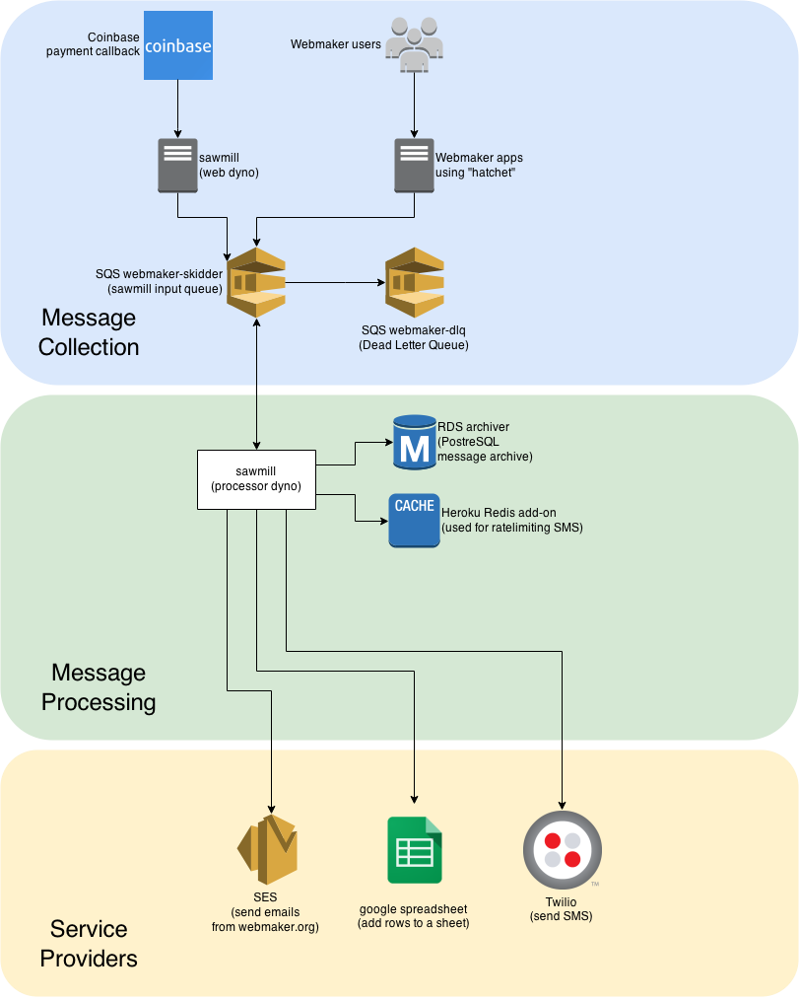

# hookshot/sawmill/lumberyard architecture

This is a proposed architecture for [sawmill](https://github.com/mozilla/sawmill/).

## The big picture

## Message Collection

Refactor out hookshot so that only sawmill and Webmaker app using hatchet are the only message collection front-ends.

Instead of having two SQS message queues, reduce down to one.

## Message Processing

Refactor out lumberyard so that message processing is done only by sawmill.

## Service Providers

Stop using Premailer & BSD
