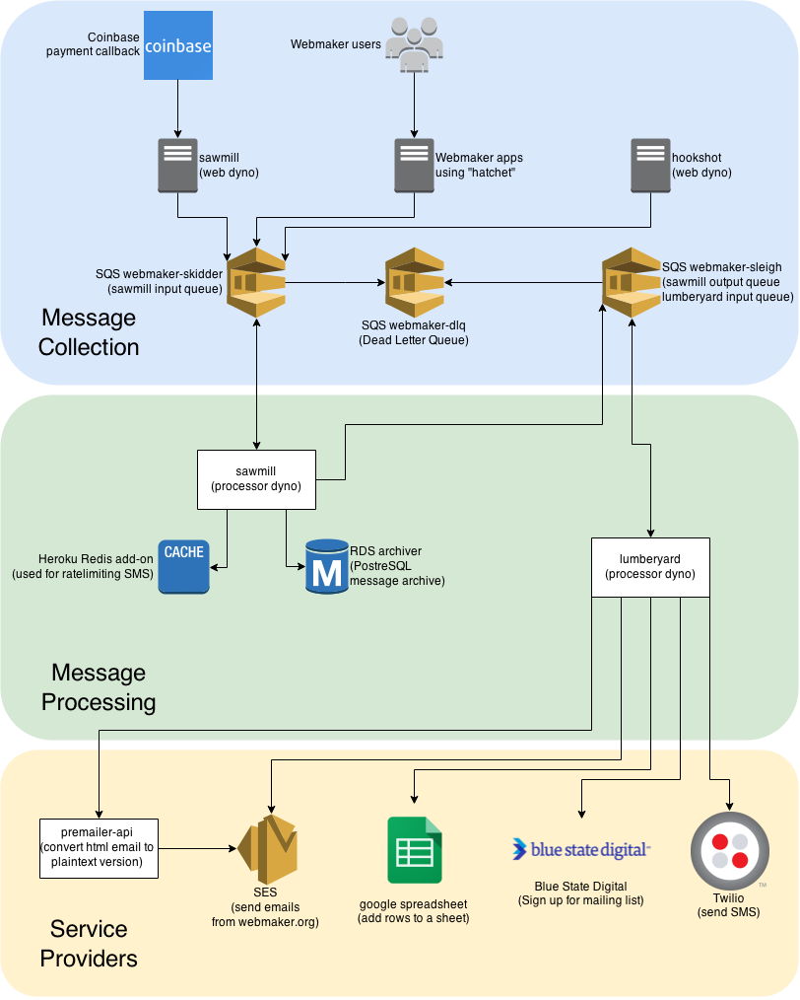

# hookshot/sawmill/lumberyard architecture

This is an architectural overview of [hookshot](https://github.com/mozilla/hookshot/), [sawmill](https://github.com/mozilla/sawmill/), and [lumberyard](https://github.com/mozilla/lumberyard/) (collectively known as HSL) as of March 2015.

## The big picture



## Message Collection

Message collection is a series of frontends (sawmill web, webmaker apps using hatchet, and hookshot web) that accept a payload and convert it into a JSON object that gets serialized and sent into a message queue (webmaker-skidder).

The sawmill web dyno is responsible for receiving callbacks from Coinbase, our Bitcoin donation provider. Any webmaker app with the correct permissions can send messages directly to the queue using [hatchet](https://github.com/jbuck/hatchet). The hookshot web dyno is responsible for receiving callbacks from badgekit-api, our badges provider.

This is an example of a `create_user` message sent by the login server after a user has created their account:

```js
{
  "app": "login",
  "event_type": "create_user",
  "timestamp": "2014-06-25T11:32:14.176Z",
  "data": {
    "username": "webmaker",
    "email": "webmaker@webmaker.org",
    "userId": 1
  }
}
```

The JSON blob has 4 attributes:

* `app` - The name of the application that sent the message
* `event_type` - The type of event sent
* `timestamp` - An ISO8601 timestamp of when the message was sent
* `data` - An object containing event-specific data

We use AWS Simple Queuing Service for queuing messages. If sawmill has fetched a message from the queue twice and it has failed to be deleted then SQS will move the message into the dead letter queue. The dead letter queue has a CloudWatch alarm that emails cade and jbuck when there are more than zero messages.

## Message Processing

Message processing is two separate processors (sawmill processor and lumberyard processor) that fetch messages from the input queue and pass them to task workers for processing. If there are any errors processing the message it will be retried until it is removed from the queue by the dead letter policy. Sawmill is responsible for archiving a copy of all incoming messages, rate limiting potentially spammy actions such as SMS, and processing a message into more atomic messages for lumberyard to process. Lumberyard is responsible for processing messages that connect to external service providers.

## Service Providers

We currently use five external service providers:

* [Premailer](http://premailer.dialect.ca/api) - Convert HTML email into plaintext email
* [AWS Simple Email Service](http://aws.amazon.com/ses/) - Send email
* [Google Spreadsheet](https://docs.google.com/spreadsheets/u/0/) - Add rows to a spreadsheet for user content submission
* [Blue State Digital](https://www.bluestatedigital.com/) - Add users to Mozilla mailing list
* [Twilio](https://www.twilio.com/) - Send SMS
